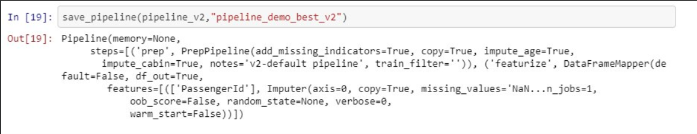

# DevScope AI Lab

Miscellaneous AI, Machine Learning & Data Science experiments 

# Experiments

##  Auto Start Dash React Application with Jupyter URL Parameters (using appmode nbextension)

  

## Deconstructing Pipelines - thoughts for easier pipelines with custom prep steps, from Jupyter to Operationalization & easy retraining

  
  
  

## SHAP Dash! Explanations on Dash 

  

## Dash Classification Eval

  

## Dash Search CV Eval  

  

  
# Run DevScope AI Lab on binder

note-Jupyter environment is preloaded with some of our favorite Notebook extensions

# Useful references

- https://mybinder.org/
- https://github.com/4QuantOSS/DashIntro 
- https://github.com/plotly/dash-svm
